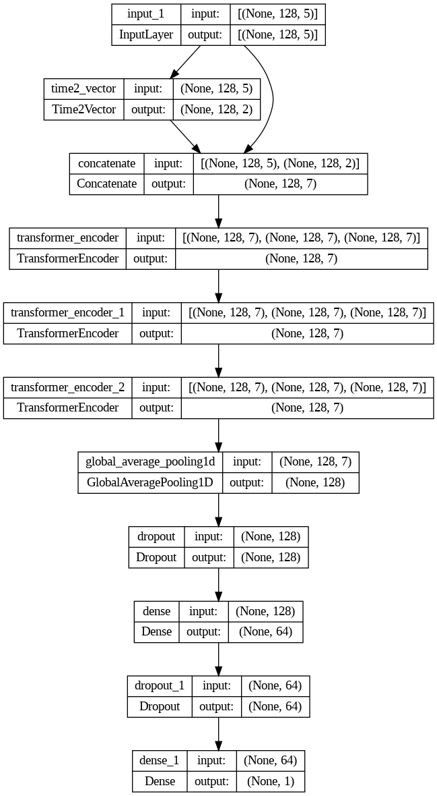

# Crypto Transformer Model

## Overview
LSTM models are widely used in the past for time series analysis and price prediction; however, in the recently year, Transformer models (with positional embeddings) have been increasingly used to predict price movements in various financial markets.
By leveraging the self-attention mechanism, Transformers can model the interactions between different time steps and capture dependencies beyond local patterns. 

## Model Structure

## BERT + Time Embeddings
The BERT model is adept at modeling sequential data, making it well-suited for tasks such as predicting next-hour prices. 
While the Transformer model, on which BERT is based, does not inherently consider position information like LSTM models do, I have addressed this limitation by incorporating time embeddings into the BERT model. 

The input is the percentage changes of “open_price”, “high_price”, “low_price”, “close_price”, “volume”.

The output is the percentage changes of “close_price”

## Time Embeddings
It consists of two components, non-periodic and periodic, to capture the patterns.  

Therefore, we will have two kinds of weights and biases to model these two embeddings.

I used 
* linear function to capture the non-periodic component 
* sine function to capture the periodic component.

## Future Works
### Distribution differences: 
The discrepancy in performance between the validation and test sets can potentially be attributed to differences in their distributions compared to the training set. By utilizing approaches specifically designed for time series analysis, such as forward-chaining validation, we can enhance the model's generalization capacity. 

### Outliers:
When dealing with outliers, such as large surges in the data, it can be challenging for the model to capture these unusual behaviors accurately. To address this, two simple approaches are to consider using a larger moving average window or segmenting the time series into different periods for modeling.
